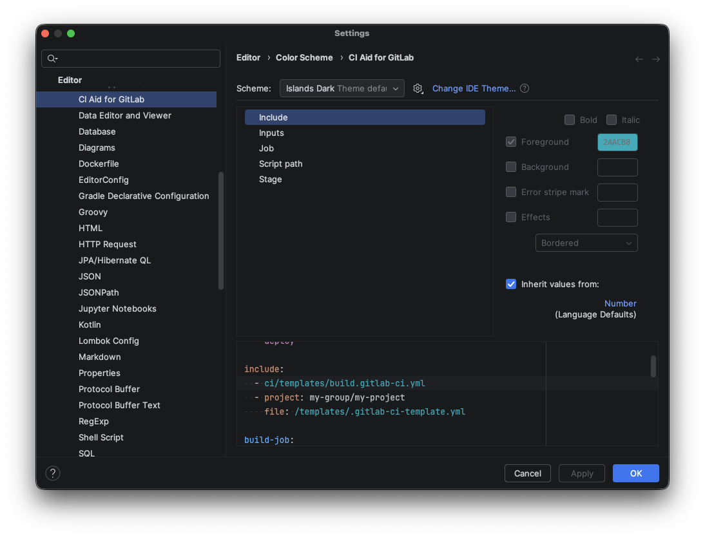

# Color Scheme

The plugin provides a dedicated **Color Scheme** settings page that allows you to customize the colors used for syntax highlighting of GitLab CI YAML elements.

You can find it under `Settings > Editor > Color Scheme > CI Aid for GitLab`.

## Configurable Attributes

The following highlighting attributes can be customized:

| Attribute       | Description                                                           | Default Fallback |
|-----------------|-----------------------------------------------------------------------|------------------|
| **Stage**       | Stage names in `stages:` definitions and `stage:` values in jobs      | Instance Field   |
| **Job**         | Job names (top-level keys) and job references in `needs:`             | Instance Method  |
| **Script Path** | File paths in `script:`, `before_script:`, and `after_script:` blocks | Number           |
| **Include**     | File paths and references in `include:` blocks                        | Number           |
| **Inputs**      | Input references such as `$[[ inputs.environment ]]`                  | Instance Field   |

## How to Customize

1. Open **Settings** (`Cmd + ,` on macOS / `Ctrl + Alt + S` on Windows/Linux).
2. Navigate to **Editor > Color Scheme > CI Aid for GitLab**.
3. Select the attribute you want to customize from the list.
4. Modify the foreground color, background color, font style, or effects as desired.
5. The preview pane on the right shows a live demo of your changes.
6. Click **Apply** or **OK** to save.
