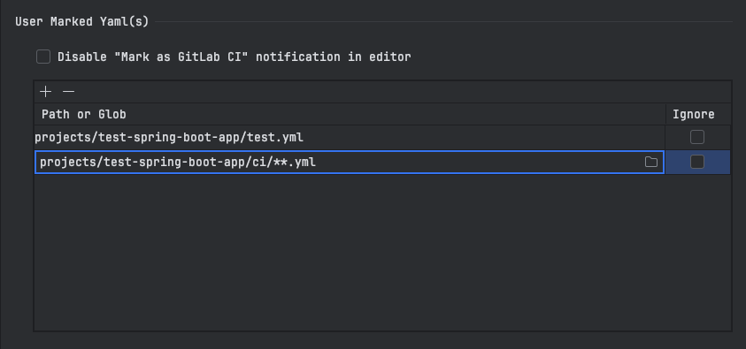

# General Settings

## Default GitLab CI YAML path

If your default GitLab CI YAML (.gitlab-ci.yml/.gitlab-ci.yaml) file is not located at the root of your project path, you can specify its path in `GitLab CI Yaml Path` textfield.
The path can be relative to the root of the project or absolute.
This setting is used to detect the GitLab CI YAML file when running the plugin.

## User marked files

The files included in default GitLab CI YAML via `include` keyword are automatically considered for usage. 
However, if you have additional YAML files that you want to be treated as GitLab CI YAML files, the plugin can detect GitLab CI YAML files automatically, and it provides an editor notification to mark the files as GitLab CI YAML.
With this setting, plugin will consider the files as GitLab CI YAML files to provider same functionality as default file.

### Adding / Removing files
The files can be added in the table with `+` button, removed with `-` button, and they can be set to be ignored by plugin with `Ignore` checkbox.
For adding the file, you can either type the file path in the text field or use the `Browse` button to select the file from the project.
Added file paths (ignored or not) don't show editor notification, if enabled, to mark them as GitLab CI YAML files.

### Multiple files with globs
You can use glob patterns to mark multiple files same way as adding/removing files. Absolute path or path relative to the project root can be used for globs.
The glob patterns follow the GitLab CI/CD wildcard includes syntax [Include with wildcard](https://docs.gitlab.com/ci/yaml/includes/#use-includelocal-with-wildcard-file-paths)

### Disable editor notification
If you want to disable the editor notification for marking files as GitLab CI YAML, you can check the `Disable "Mark as GitLab CI" notification in editor` checkbox.

