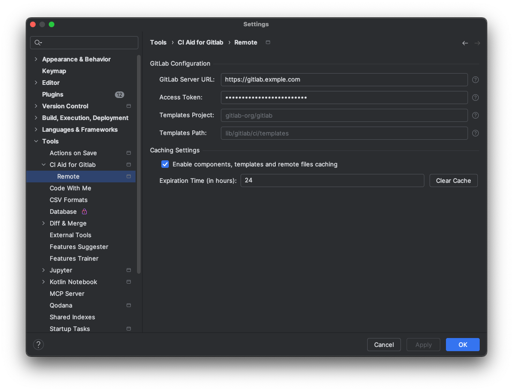

# Remote

## GitLab Configuration

In order to use remote includes such as `component`, `template`, and `project`, you need to configure the remote in the plugin settings. This is necessary if the URL to the remote file requires authentication.

User can access the remote configuration dialog from `Settings > Tools > CI Aid for Gitlab > Remote`. Here you can add, edit, or remove GitLab configuration. It is used to fetch the remote files and provide the functionality as if they were local files.
GitLab remote can be configured with the following fields: 

- **GitLab Server URL**: The URL of the GitLab instance. For example, `https://gitlab.com` for GitLab.com or `https://gitlab.example.com` for a self-hosted GitLab instance.
- **Access Token**: The personal access token with `api` scope to access the GitLab API. This is required if the remote file requires authentication. 
  You can create a personal access token in your GitLab profile settings under "Access Tokens". [Personal Access Tokens](https://docs.gitlab.com/user/profile/personal_access_tokens/)
- **Templates Project**: Refer [Templates](#templates)
- **Templates Path**: Refer [Templates](#templates)

## Templates
If you are using a self-hosted GitLab instance, you can configure the project and path to the templates repository in the remote settings. The plugin will fetch the template from the specified URL.
For example, if your templates repository is located at `https://gitlab.example.com/gitlab/-/tree/master/lib/ci/templates`, you can specify the project as `gitlab` and path as `lib/ci/templates` in the remote settings.

## Caching
The plugin caches the remote files in the IntelliJ cache director. This is done to avoid fetching the remote files every time they are needed. The cache is updated when it expires, the expiration time is set to 24 hours by default. You can change the cache expiration time in the plugin settings.
If you don't want to use the remote includes or in general not use caching, you can disable it in the plugin settings using `Enable components, templates and remote files caching` checkbox. This will disable the caching of remote files totally, it will not remove existing cached files, if previously cached.
To remove the cached files, you can use the `Clear cache` button in the remote settings dialog. This will remove all the cached files, and they will be fetched again when needed.

