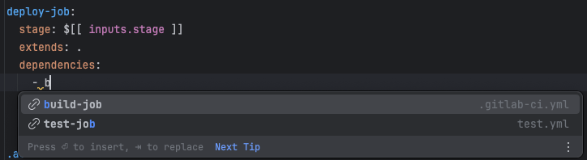
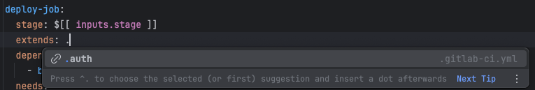
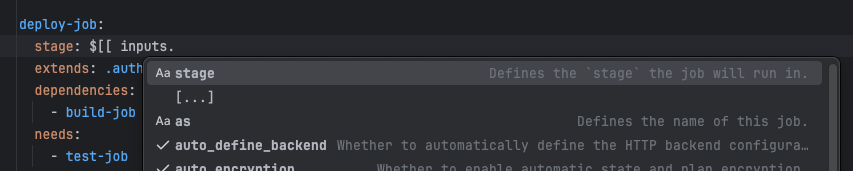
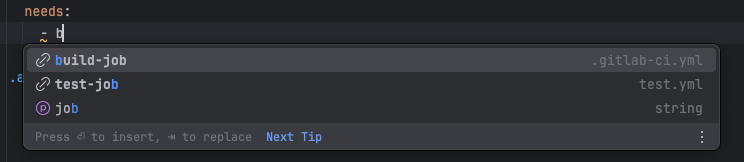
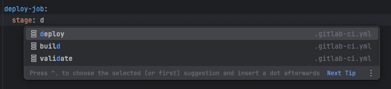
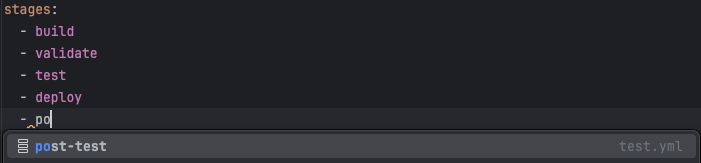
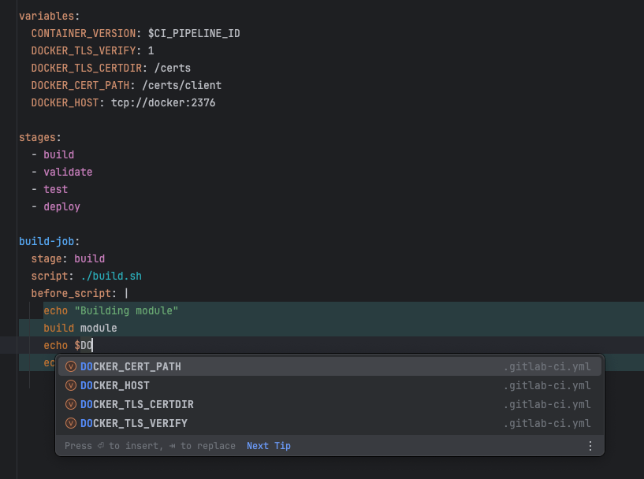
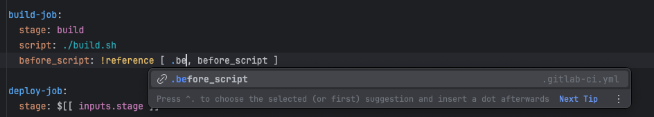

# Auto-completion

Various code completion features are available in the GitLab CI YAML files, automatic code completion suggestions are provided as you type. You can also use `Ctrl + Space` to trigger code completion manually.

### dependencies

When you type `dependencies:`, the plugin will suggest all jobs defined in the known files with a link icon and the file containing the stages section.

### extends

When you type `extends:`, the plugin will suggest all jobs defined in the known files with a link icon and the file containing the stages section.

### inputs

When you type `$[[ inputs.`, the plugin will suggest all inputs defined in the `inputs` section with an input icon and the file containing the inputs section.
Depending on the type of the input, the plugin will suggest different types of inputs. For example, if the input is a string, it will show a text icon, check mark for a boolean, map for array, etc.

### needs

When you type `needs:`, the plugin will suggest all jobs defined in the known files with a link icon and the file containing the stages section.
Hidden jobs (starting with `.`) are not suggested, as they do not run in the pipeline.

### stage

When you type `stage:`, the plugin will suggest all stages defined in the `stages` section with a stage icon and the file containing the stages section.

### stages

In the `stages` section, the plugin will suggest all stages (except the already defined ones) defined in the `stage` value of all the jobs with a stage icon and the file containing the stages section.

### variables

Variables defined in the `variables` section are available for code completion. In `before_script`, `script`, or `after_script` sections variables are suggested for auto-completion with the file they are defined in.

When you type `$` or `${`, the plugin will suggest all variables defined in the `variables` section. 

### !reference

When you type `!reference [ ]`, the plugin will suggest all available references in the project with a link icon and the file containing the reference. Only hidden jobs (starting with `.`) are suggested as references.
If a reference contains nested key, it will be suggested to auto-complete after (,) in the reference e.g., !reference [ .before_script, be(auto-completion-suggestions-here) ].

