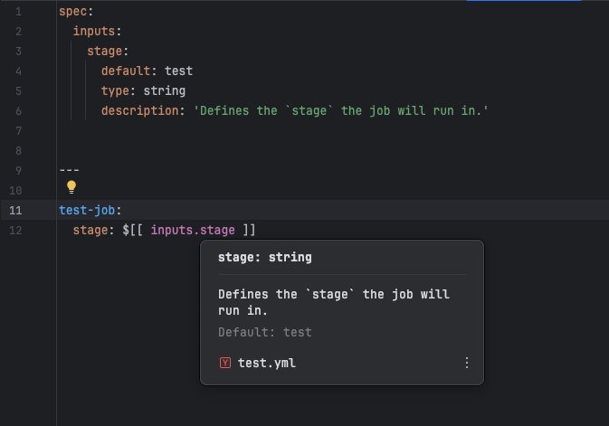

# Documentation

## Inputs

Documentation is provided when hovering over inputs variable (`$[[inputs.variable]]`) in the editor. This includes the variable name, type, and a description of what the variable is used for, default value and the file path containing the input.

