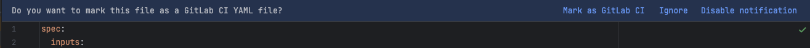

# GitLab CI YAML Detection

Plugin can automatically detect potential GitLab CI YAML files using certain keywords. User can mark the file as GitLab CI YAML file to enable the plugin functionality for that file and usages across other files.
The notification can be ignored, and it will not be shown again for that file.

User can disable the editor notification using `Diasble notification` in the same notification or in the plugin settings ([Disable editor notification](../configuration/general#disable-editor-notification)).
