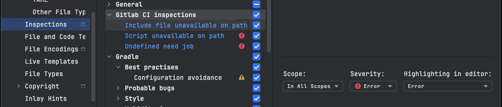

# Inspections

Inspections are a way to check the correctness of your GitLab CI/CD YAML files. They help you identify potential issues, such as syntax errors, missing files, or undefined jobs. The inspections are run automatically when you open a YAML file in the editor.
Available inspections can be found in the `Settings > Editor > Inspections > Gitlab CI inpsections ` section. User can configure their scope, severity levels and highlighting.

## Available Inspections

### Unavailable local include file

This inspection checks if the local file included (`include` keyword) is available in the project. If the file is not found, it will show an error in the editor.
User can also quick fix the issue by plugin provided quick fix. ([Create include file](./quick-fixes#missing-local-file-include))

### Unavailable script file

This inspection checks if the script file included (`script`, `before_script`, `after_script` keywords) is available in the project. If the file is not found, it will show an error in the editor.
User can also quick fix the issue by plugin provided quick fix. ([Create script](./quick-fixes#missing-script-file))

### Undefined need

If a job has a `needs` keyword, this inspection checks if the job is defined in the included or user marked YAMLs. If the job is not found, it will show an error in the editor.

