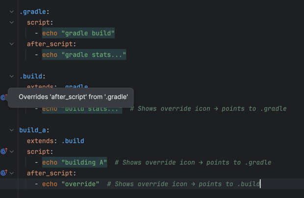

# Override Indicators

Override indicators are visual markers displayed in the gutter (left margin of the editor) that show when a job property overrides a parent job property through the `extends` inheritance chain.

When a job extends another job and overrides one of its properties (such as `after_script`, `before_script`, `script`, `image`, etc.), an override icon appears in the gutter next to the property. Clicking on this icon navigates directly to the parent job's property that is being overridden.

## How it works

The plugin tracks the inheritance chain through the `extends` keyword and identifies properties that are defined in both the child job and one or more parent jobs in the chain.

### Example

In this example:
- The `after_script` in `.build` shows an override indicator that navigates to the `after_script` in `.gradle`
- The `script` in `build_a` shows an override indicator that navigates to the `script` in `.gradle` (skipping `.build` which doesn't have it)
- The `after_script` in `build_a` shows an override indicator that navigates to the `after_script` in `.build` (the nearest parent with this property)

## Supported properties

Override indicators work for the following job properties:
- `after_script`
- `before_script`
- `script`
- `cache`
- `image`
- `services`
- `variables`
- `artifacts`
- `stage`
- `needs`
- `dependencies`
- `rules`
- `interruptible`
- `tags`

## Navigation

Click on the override icon in the gutter to navigate to the parent job's property that is being overridden. This helps you quickly understand what is being changed and trace the inheritance hierarchy.

