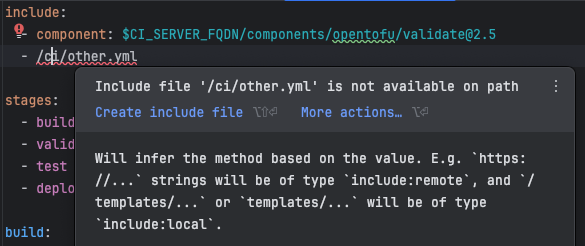
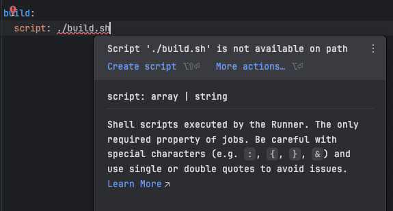

# Quick Fixes

Following quick fixes are available for GitLab CI YAML files:

### Missing local file include
If a local file is included using `include` keyword (directly under it or in `local`), but the file does not exist, the plugin will provide a quick fix `Create include file` to create the file.
The file will be created with the directory structure as specified in the include path. For following example, the file will be created at `ci/other.yml` path, if the ci directory does not exist, it will be created as well.

### Missing script file

If a file defined in `script`, `after_script` or `before_script` keywords does not exist, the plugin will provide a quick fix `Create script` to create the file.

