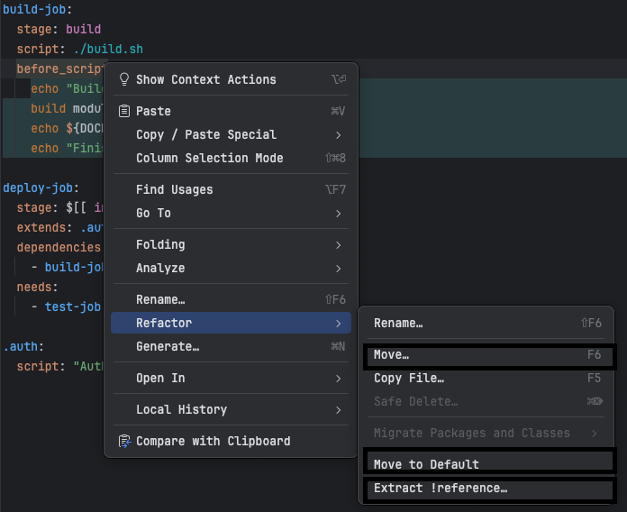
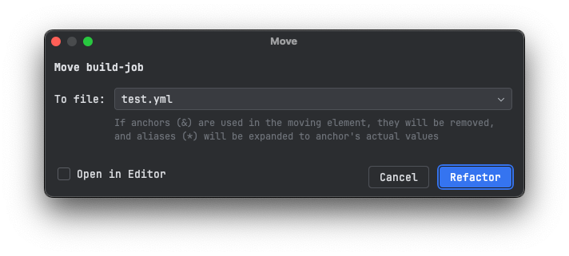
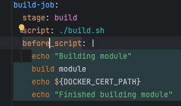
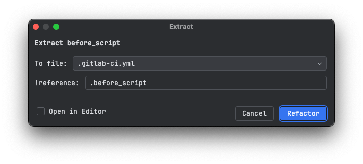
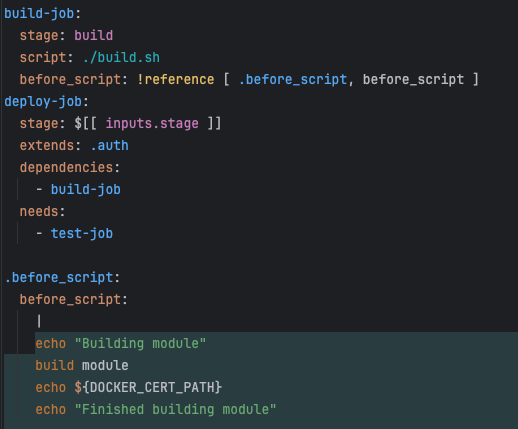

# Refactoring
Refactoring actions can be performed on GitLab CI YAML files to improve the structure and maintainability of the configuration. The plugin provides several refactoring options that can be accessed from the context menu of a job or section in the YAML file.

Following refactorings are available for GitLab CI YAML files:

### Move job to another file

From refactoring menu (right-click on the job > `Refactor` > `Move...`), you can move the job to another file. The plugin will prompt you to select the target file from all known files, and it will move the job to that file. 
The job will be removed from the original file, and if the job is using YAML anchors (&) they will be removed, and the aliases (*) will be replaced in line to moved job with actual values.

`Open in Editor` checkbox can be used to open the target file in the editor after the refactoring is done.

### Move to Default

From refactoring menu (right-click on the job > `Refactor` > `Move to Default`), you can move supported elements to `default` section.
If the `default` section does not exist, it will be created at the top of the file.

GitLab CI/CD supports `default` section to define default values for jobs, currently supported elements are `after_script`, `artifacts`, `before_script`, `cache`, `image`, `interruptible`, `id_tokens`, `identity`, `retry`, `services`, `tags`, `timeout` and `!reference`.

### Extract !reference

From refactoring menu (right-click on the job > `Refactor` > `Extract !reference`), you can extract the selected section of a job to a reference tag (!reference). 
The plugin will prompt you to enter the name of the reference tag, and it will replace the selected section with the reference tag in the job. The reference tag will be added to the bottom of the file, and it will be used in the job.

`Open in Editor` checkbox can be used to open the target file in the editor after the refactoring is done.

###### Before Refactoring:

###### Refactoring:

###### After Refactoring:

