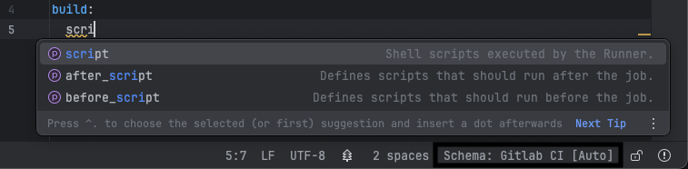

# Schema Provision

Official GitLab CI YAML schema is provided by the plugin to enable code completion, validation, and other features in the GitLab CI YAML files.
The schema can be changed/disabled in the status bar in the bottom right corner of the IDE.

