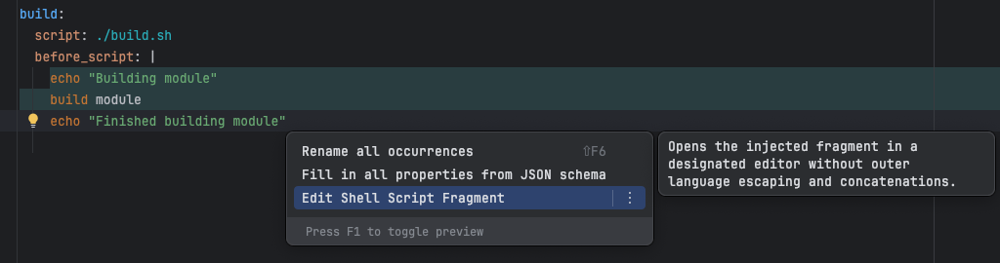
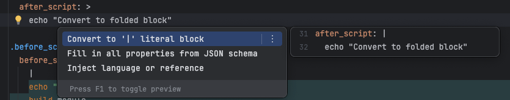

# Script Injection

Shell script is injected into the `script`, `before_script`, and `after_script` sections in the GitLab CI YAML files. This allows you to write shell commands directly in the YAML file, or they can be edited as standalone shell script editor using `Edit Shell Script Fragment` context action.

If you have `BashSupport Pro` plugin installed and license configured, the shell script will be highlighted and inspected using the `BashSupport Pro` shell editor.

### Known Limitation
Currently, the plugin injects shell script into the sequence item (-) sections and YAML literal blocks (|). Due to weird editing issues in folding block (>) injection is not supported.
Instead, plugin provides an intent action to convert the folding block to a literal block, so you can use shell script injection in it.

