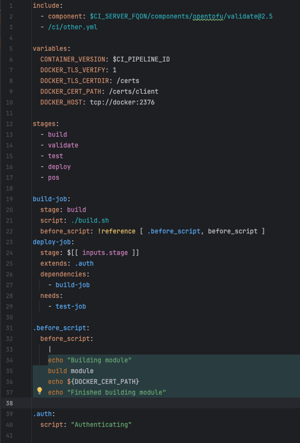

# Syntax Highlighting

Plugin highlights various keywords and elements in GitLab CI YAML files to enhance readability and understanding of the configuration. 
This includes highlighting stages, jobs, scripts, files, includes, inputs, references, and more.

