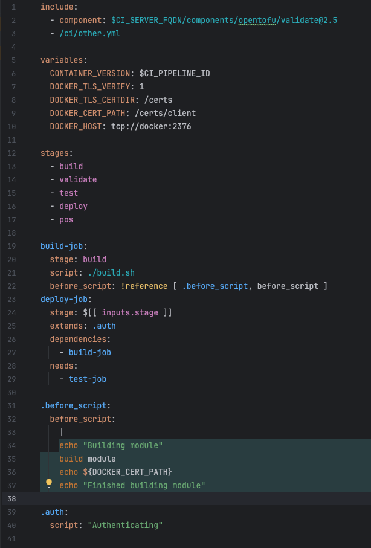

# Syntax Highlighting

Plugin highlights various keywords and elements in GitLab CI YAML files to enhance readability and understanding of the configuration. 
This includes highlighting stages, jobs, scripts, files, includes, inputs, references, and more.

## Customizing Colors

The highlighting colors are fully configurable through the dedicated Color Scheme settings page. See [Color Scheme Configuration](../configuration/color-scheme.md) for details.

